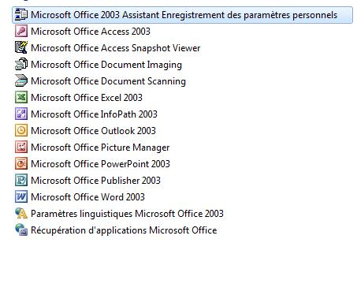
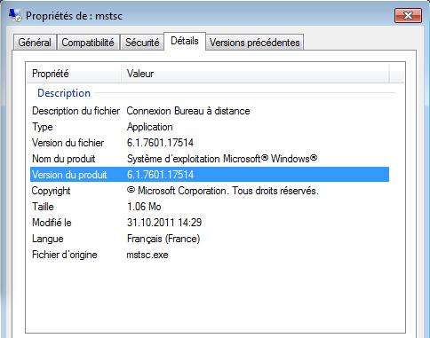
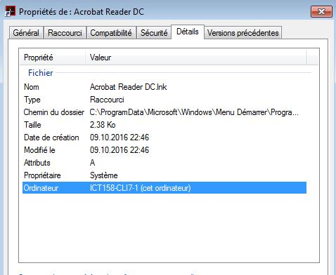

# Environnement
## Nom de domaine

Comme dans la capture ci-dessous de nom de domaine est "Scuolapro.local"

Le FQDN ou Fully Qualified Domain Controller est "ict158-srv03-1.scuolapro.local"

## IP

L'adresse du server est 10.1.1.20 avec comme passerelle par défaut 10.1.1.1 et le serveur DNS pointe sur lui même.

L'adresse du client est 10.1.1.41, on peut constater également que l'adresse IP a bien été attibué par le serveur DHCP est pas rentrer manuellement, la passerelle par défaut est 10.1.1.1 et le serveur DHCP et DNS pointe bien sur l'adresse du serveur windows 2003.

Chose bizarre lorqu'on regarde les adresses réservé, la machine cliente windows 7 semble avoir deux adresses IP qui lui ont été attribué et active au même moment, mais si on tente de pinger la machine 10.1.1.40 sur le serveur et le client elle ne répond pas mais la 10.1.1.41 fonctionne.

Le serveur ne semble pas pouvoir pinger la machine 10.1.1.41, mais le client lui arrive à le pinger, il semble y avoir un problème avec le pare-feu.

## Réseau

Dans la capture ci-dessous nous pouvons voir que l'adresse du réseau est 10.1.1.0

le masque de sous réseau est 255.255.255.0 ou /24

La pool d'adresse IP sont entre 10.1.1.40 et 10.1.1.199

Ici on peut voir que l'adresse du routeur est 10.1.1.1, l'adresse du DNS est 10.1.1.20 lui même et le nom de domaine est "ScuolaPro.local".

Voici un état des lieux du réseau actuelle.

## Déploiement auto *wim

Sur le bureau du windows server 2003 il y a un raccourci qui mène au déployement d'os qui est visiblement situé dans le fichier download du disque D:

Dans le dossier images il y a l'image windows 7 qu'utilise la machine cliente.

En revenant sur le dossier on peut y trouver un fichier texte à lire

Egalement un autre fichier texte qui semble contenir un code comme un script mais il est en fichier texte, il semble qu'il sert à créer deux partitions différentes.

Sinon il ne reste que deux script en .bat, "DeployImage", qui j'imagine sert à déployer l'image windows du client.

et "ExtractImage" qui sert à enlever l'image de la machine

## Imprimantes

Il y a un total de 7 imprimantes connecté sur le même réseau, une pour chaque département.

Les printers sont tous des HP LaserJet 4250 PCL 5e, pour l'instant seulement une seule imprimante est utilisée, la HP_IT.

Dans cette capture nous pouvons voir les quelles adresses IP correspond à quelle imprimante.

Toutes les imprimantes possèdent le même pilote, le "HP Laserjet 4350 PCL 5e".

# Serveurs
## Hardware
Checker la documentation dans ce repository :

https://github.com/Vinkhey/ICT-158/blob/main/Doc%20Machines/doc_HPServer.pdf

## OS
Capture d'écran de l'os installé sur le serveur :

Nous pouvons donc constater que l'os installé est "Microsoft Windows Server 2003" la version standard.

## Services
### DHCP

Comme indiqué plus haut dans le document, il y a une étendue "SculoaPro_DHCP" sur l'adresse 10.1.1.0, le serveur DHCP est le serveur lui-même en 10.1.1.20

La Pool d'adresse distribuable est entre les adresses 10.1.1.40 et 10.1.1.199

On peut constater qu'une adresse IP à déjà été attribuée à la machine cliente avec pour adresse 10.1.1.40 est la fin du bail d'une durée de 8 jours.

Aucune réservation d'adresse IP n'a été effectuée.

Ici on peut constater les options d'étendues, le routeur avec l'adresse 10.1.1.1 et le serveur DNS en 10.1.1.20 avec comme nom de domaine ScuolaPro.local

Aucune option de serveur n'a été effectuée

### AD

Comme mentionné au début de ce document le nom de domaine est "ScuolaPro.local" et le FQDN est "ict158-srv03-1.scuolapro.local", le controleur de domaine est "ScuolaPro.local", il n'y a pas de sous-domaine.

Ici on peut retrouver les groupes utilisateurs créer par défaut par l'os.

Ici on retrouve les machines du réseau.

Ici on retrouve le controlleur de domaine qui est le serveur lui-même.

Aucun principe de sécurité étrangère

### Unité d'organisation

Dans l'unité d'organisation "ScuolaPro-Ste-Croix", on peut retrouver un groupe pour chaque département contenant les utilisateurs concernés :

Ici on peut retrouver les différents autres groupes.

### DNS

Les options du serveurs DNS :

Dans la zone de recherche directe, le domaine ScuolaPro.local

Aucune zone de recherche inversée

Ici on peut notamment retrouver le FQDN du domaine, il y a également un alias CNAME "5e514734-7b39-4d21-aff5-270ee42d3261._msdcs.Scuolapro.local"

Ici on peut retrouver tout les hotes du domaine.

### File Server

Toute les options du FileServer, partage local :

Sessions local :

Fichiers ouverts :

Pour défragmenter les disques :

Les options de partitions de disques :

## Raid5

Le raid 5 est partagée en plusieurs partitions nommée Data avec comme lettre d: entre les disques 1 à 3 avec une capacité totale de 80 Go ainsi que de type NTFS et le disque c: de 40Go également de type NTFS.

# Client

## Hardware :

- 35 machines clientes de type [Dell Latitude E6510](https://github.com/Vinkhey/ICT-158/blob/main/Doc%20Machines/latitude-e6410-e6510-specsheet.pdf) cliquez sur le nom pour afficher la documentation Dell. Le Dell latitude E6510 est incompatible avec Windows 10.

- 10 machines clientes de type [Dell Latitude E6530](https://github.com/Vinkhey/ICT-158/blob/main/Doc%20Machines/dell-e6530.pdf) cliquez sur le nom pour afficher la documentation Dell. Le Dell latitude E6530 est compatible avec Windows 10.

- 5 machines clientes de type [Dell Optiplex 990](https://github.com/Vinkhey/ICT-158/blob/main/Doc%20Machines/optiplex-990-tech-guide.pdf) cliquez sur le nom pour afficher la documentation Dell. Le Dell Optiplex 990 n'est pas compatible avec Windows 10.

## OS de la machine client :

Windows 7 Entreprise 64 bits

## Réseau :

Nom de l'hôte : ICT158-CLI7-1

Suffixe DNS Principal : Scuolapro.local

Adresse physique :  00-0C-29-D6-17-2F

Adresse IPv4 : 10.1.1.41

Masque de sous-réseau : 255.255.255.0

Passerelle par défaut : 10.1.1.1

Serveur DHCP : 10.1.1.20

Serveur DNS : 10.1.1.20

## Logiciels :

### Office :

### Antivirus :

Nom : Avira Antivirus

Version du produit : 15.0.20.59 -> Date : 25.08.2016

License : Non-valable

### Bureau à distance :

### Adobe reader :

# Users

## Users Existants

La liste de tout les utilisateurs du domaine :

## Appartenances aux groupes

Certains utilisateurs ne font pas partis de leur groupe mais d'autre oui :

Mélanie Alonso dans Back-Office :

Dana Shipper dans Comptabilite :

Marc Mueller dans Direction :

Tim Brown dans IT :

Jean-Michel dans Logistique :

Andre Dupre dans Marketing :

Juerg Haefeli dans Production :

## Script Logon

Il y a un script différent pour chaque utlisateur selon sont affiliation aux départements :

Le chemin où sont stocker tout les scripts :

## Profils itinérants

Dans cette capture ont peut voir le chemin du profil de l'utilisateur, ils ont tous le même chemin mais en changeant juste le selon leur prénom et nom

## Dossier personnel

Chaque dossier perso des utilisateurs est monté sur un lecteur U:, changeant également nom en fonction de leur prénom et nom

