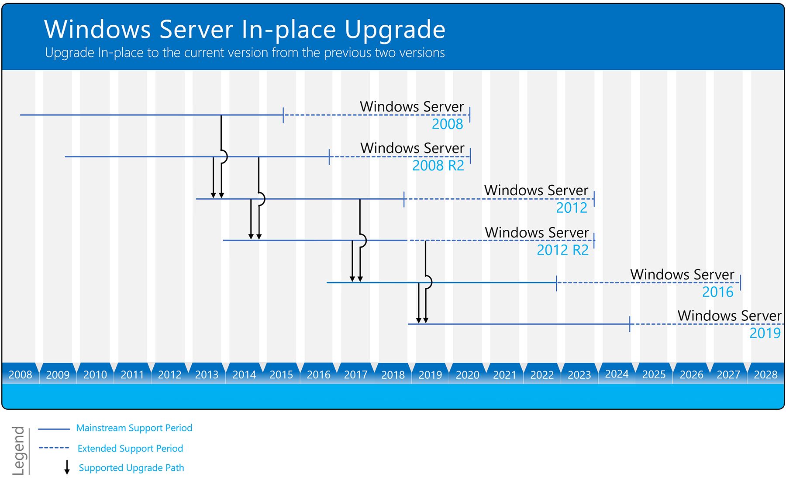

# Pratique
# Changement du Hardware

Selon microsoft le système minimale pour installer windows server 2019 est :

## Processor

### Minimum:

    1.4 GHz 64-bit processor
    Compatible with x64 instruction set
    Supports NX and DEP
    Supports CMPXCHG16b, LAHF/SAHF, and PrefetchW
    Supports Second Level Address Translation (EPT or NPT)

## RAM

### Minimum:

    512 MB (2 GB for Server with Desktop Experience installation option)
    ECC (Error Correcting Code) type or similar technology, for physical host deployments

## Storage controller and disk space requirements

Computers that run Windows Server 2019 must include a storage adapter that is compliant with the PCI Express architecture specification. Persistent storage devices on servers classified as hard disk drives must not be PATA. Windows Server 2019 does not allow ATA/PATA/IDE/EIDE for boot, page, or data drives.
Minimum: 32 GB

## Network adapter requirements

### Minimum:

    An Ethernet adapter capable of at least gigabit throughput
    Compliant with the PCI Express architecture specification.

A network adapter that supports network debugging (KDNet) is useful, but not a minimum requirement.

A network adapter that supports the Pre-boot Execution Environment (PXE) is useful, but not a minimum requirement.

## Choix du matériel

[HPE ProLiant MicroServer Gen10 Plus](https://buy.hpe.com/ch/fr/servers/proliant-microserver/proliant-microserver/proliant-microserver/hpe-proliant-microserver-gen10-plus/p/1012241014)

Processeur : Intel Xeon E-2224
Vitesse : 3.40GHz
RAM : 16Go
Type : DDR4
Vitesse de RAM : 2666 MHz
Capacité de stokage : 4 x 1Tb 

Prix : 820.-

## Justification financière

Ce serveur est puissant, petit et a un faible coût. Il est parfait pour les petites entreprises. Nous avons choisi celui-ci, car il remplit les critères pour l'entreprise. Étant donné qu'il possède 4 disques dur, il n'y aura pas de soucis avec le RAID 5. 

# Migration des données
## Méthode 1

La première méthode consisterai à migrer le server de 2003 à 2008 puis 2012, 2016 et enfin 2019 en utilisant l'outil de micorsoft "Storage Migration Service"

Il est apparament impossible de transférer directement les données d'un server 2003 à 2019, en suivant le shéma ci-desssus, nous devrions d'abord upgrade de 2003 à 2008 puis 2012, 2016 et enfin seulement nous pourrons atteindre la version 2019.

Cette outil peut migrer le file server d'un serveur à un autre, donc toutes les datas du serveur et les partages, il ne permet pas de migrer le reste des services ni les logiciels installés. Par contre il permet de transférer les groupes et utilisateurs ainsi que les droits ntfs et de partage, il ne peut migrer les controlleur de domaine.

## Méthode 2

La deuxième méthode consisterai à transférer les données manuellement par clé usb et recréer les partages sur le nouveau serveur. par contre nous perdrons les droits et devrons les recrées également.

## Méthode 3

Nous pourrions utiliser la commande powershell robocopy qui permet de copier les files entre les deux serveurs ainsi que les droits ntfs, par contre il faudra recréer les partages manuellement mais au moins les droits seront conservés. Il faut également transférer les options de partage car sinon les partages ne seront pas vu par le serveur.

## Justification de la méthode choisie

La méthode 3 semble être non seulement la plus rapide mais également la plus facile des méthodes car elle ne prend pas en compte l'upgrade des serveurs fastidieuse et permet de limiter la perte de temps de la méthode 2.

# Migration des Services
## Méthode 1
## Méthode 2
## Justification de la méthode choisie
## description
